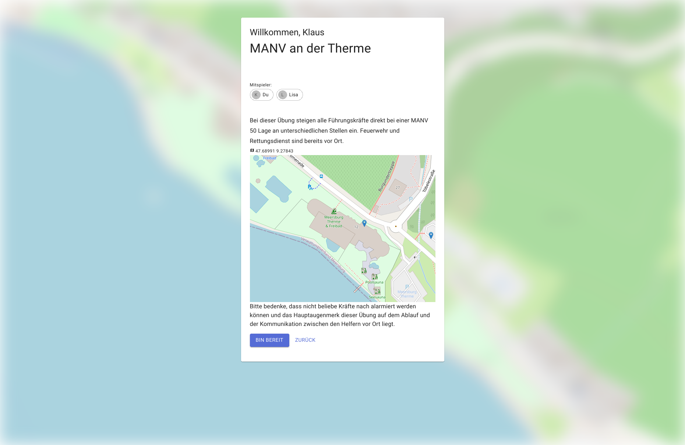

The Einsatzsimulator provides a possibility for executives of the civil
protection to train their communication and organization skills. Currently the
project is not ready for production, but it provides a useable prototype.

*This project was part of the 10th round of the [Prototype Fund][ptf] and got
therefore funds from the german [Federal Ministry of Education and
Research][bmbf] (Bundesministerium für Bildung und Forschung)*

## :heart_eyes: Features
This application is work in progress, and provides currently the following
features for the work of civil protection in Germany.

- Creating training sessions for medial executives from templates
- Multiple order detection (in german) available to command your troops
    - Movement order
    - Threat order
    - Prioritize order
- Evolution of patients according to a predefined event based sequence
- Detail view of patients and triage tag
- Map of current location
- Event based messages (prepared)

## :handbag: Roadmap
Since this application is a prototype, there is a huge list of features we would
like to implement in the feature.

- Multi language support
- Radio communication between all players
- More commands
- Improved language understanding
- Support for more organizations like the FD
- Debriefing with backlog of all actions
- Template designer
- Portal to share templates and compare different operations

## :rocket: Getting Started
This is a [Next.js] application with custom server to handle socket connections.
We assume you have [yarn], [node] (>= 14) and [docker] installed on a Linux system like
Ubuntu 21.04.

- Download, or clone the repo.
- Install all dependencies inside the root folder (`yarn install`).
- Train the NLU model to understand orders (`./nlu/train.sh`).
- Create a configuration file `.env.local` and use `.env.example` as base.
- Create db structure and seed database (`yarn prisma db push && yarn prisma seed`).
- Build the application (`yarn build`).
- Start the NLU server (`./nlu/run.sh`).
- Start the application server (`yarn start`).

Now you are able to try our example mission.

## :camera: Screenshots

[ptf]: https://prototypefund.de/
[bmbf]: https://www.bmbf.de/
[Next.js]: https://nextjs.org
[yarn]: https://yarnpkg.com/
[node]: https://nodejs.org/
[docker]: https://www.docker.com/